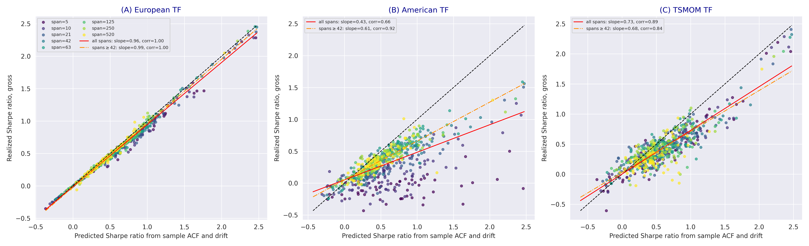

# TrendFollowingSystems

**Closed-form expected return, Sharpe ratio, and turnover of trend-following
systems under white noise, AR(1), and ARFIMA processes — with three complete
system implementations (European, American, Time Series Momentum), Monte Carlo
verification, and an 84-contract futures dataset spanning 1959–2026.**

[](https://github.com/ArturSepp/TrendFollowingSystems/actions/workflows/ci.yml)
[](https://github.com/ArturSepp/TrendFollowingSystems)
[](LICENSE)

**Paper:** Sepp, A. and Lucic, V., *The Science and Practice of Trend-Following
Systems*, submitted to the *SIAM Journal on Financial Mathematics*. The SSRN
preprint is at [ssrn.com/abstract=3167787](https://papers.ssrn.com/sol3/papers.cfm?abstract_id=3167787)
(doi:[10.2139/ssrn.3167787](https://dx.doi.org/10.2139/ssrn.3167787)), and the
submitted manuscript is compiled at
[`papers/tf_systems/paper/TrendFollowing_PaperA_SIFIN_v1.pdf`](papers/tf_systems/paper/TrendFollowing_PaperA_SIFIN_v1.pdf).
See [Citation](#citation) for the BibTeX entry. The replication material for
every figure and table is in [`papers/tf_systems/`](papers/tf_systems/).

`trendfollowing` implements the paper's central result: an exact decomposition
of the European trend-following system's P&L into an autocorrelation channel
and a squared-drift channel,

$$
\bar F_{1y} \;=\; h \sum_{m=1}^{\infty} \nu^{m}\rho(m) \;+\;
\frac{l\,\sigma_{\mathrm{target}}}{\sqrt{a}}\,\mu^{2},
\qquad h = l\,\sigma_{\mathrm{target}}\sqrt{a}\,\frac{1-\nu}{\nu},
$$

where $\rho(m)$ is the autocorrelation function of volatility-normalized
returns, $\mu$ their annualized drift, and $\nu$ the filter smoothing parameter
of the span. The annualized Sharpe ratio follows in closed form for any causal
linear process, with the excess kurtosis of the innovations entering through a
single loading. On 84 liquid futures contracts, the closed form applied to
sample moments reproduces the realized Sharpe ratios of the European system
with a pooled correlation of 0.99 and a regression slope of 0.96.

The package is useful when three things matter:

- You want to **select the filter span analytically** rather than by grid
  search: the AR-1 break-even cost is nearly span-invariant
  ($c^{*}_{\infty} = \sqrt{\pi/2a}\,\phi/(1-\phi)$, 37–41bp at $\phi = 0.05$),
  while ARFIMA long memory creates an interior cost-optimal span — two regimes
  the closed forms separate cleanly.
- You want to **predict a contract's trend-following Sharpe ratio from its
  autocorrelation function and drift** before running a backtest, and to
  attribute realized performance to trend, mean reversion, and drift.
- You want **three reference system implementations** — continuous EWMA-filter
  weights, binary crossover positions with ATR stops, and sign-based time
  series momentum — that run out of the box on the packaged dataset, net of
  volume-based costs, with portfolio volatility targeting.

The analytics layer is pure numpy/scipy: every formula is a function you can
read. The backtest layer builds on [`qis`](https://github.com/ArturSepp/QuantInvestStrats).

---

## Installation

```bash
git clone https://github.com/ArturSepp/TrendFollowingSystems.git
cd TrendFollowingSystems
pip install -e ".[dev]"
```

Python >= 3.10 and `qis` >= 5.0.6. The analytical layer and the Monte Carlo
verification run without any data. The empirical layer runs from the dataset
packaged in `trendfollowing/resources` (84 futures contracts, benchmarks,
volume-based costs; 1959–2026).

## Quickstart

The closed forms re-export at the package top level:

```python
import trendfollowing as tf

# closed-form Sharpe ratio of the European system under an AR-1 process
sr = tf.sharpe_ar1(phi=0.05, long_span=21)                      # 0.336

# the generic formula: any population autocorrelation function
rho = tf.population_acf(n_lags=2000, phi=-0.05, d=0.1)          # ARFIMA(1,d,0)
sr = tf.compute_annualised_sharpe(rho=rho, long_span=250, short_span=20)

# the canonical realized-Sharpe estimator shared by all estimation layers
sr_hat = tf.compute_realized_sharpe(returns=daily_returns, af=260.0)
```

A portfolio backtest of the paper's LS(250,20) filter on the packaged universe:

```python
from trendfollowing.universe import load_data
from trendfollowing.systems.european import run_european_tf_system

prices, volume_costs, benchmark_prices, descriptive_df, group_order = load_data()
outputs = run_european_tf_system(prices=prices,
                                 long_span=250,
                                 short_span=20,
                                 vol_span=33,                  # volatility estimator span, days
                                 portfolio_covar_span=63,      # portfolio-level volatility targeting
                                 portfolio_target_vol=0.15,
                                 volume_costs=volume_costs,
                                 warmup_period=250)
nav = outputs.portfolio_pnl_net                                # compounded nav, net of costs
```

Net of volume-based costs and gross of fees, this configuration delivers a
Sharpe ratio of 1.10 at a 15.2% realized volatility over 1960–2026
([`examples/backtest_european_system.py`](examples/backtest_european_system.py)).

## The three systems

**European** ([`systems/european.py`](trendfollowing/systems/european.py)):
continuous weights from a variance-preserving EWMA filter, single or
long-short, applied to volatility-normalized returns, with volatility-targeted
position sizing. The system of the closed forms.

**American** ([`systems/american.py`](trendfollowing/systems/american.py)):
binary positions from the crossover of two price EWMA filters with an ATR
entry buffer and ATR trailing stop-losses, in the tradition of the turtle
systems. Position size is fixed at trade inception.

**TSMOM** ([`systems/tsmom.py`](trendfollowing/systems/tsmom.py)): the
normalized sum of signs of volatility-normalized period returns, generalizing
Moskowitz–Ooi–Pedersen time series momentum to a period length L and lookback
of M periods.

At matched lookbacks the three systems correlate at 80% on average with the SG
Trend Index and deliver statistically indistinguishable Sharpe ratios by the
Ledoit–Wolf test: 0.47, 0.50, and 0.55 against 0.47 for the SG Trend Index, on
monthly returns net of costs and 2/20 fees. The European closed form therefore
ranks the performance of all three designs.

## Closed-form results

For volatility-normalized returns with autocorrelation function $\rho(m)$ and
annualized drift $\mu$, the annualized Sharpe ratio of the European system is

$$
SR \;=\; \frac{\sqrt{a}\,A_{\nu} + \mu^{2}/\sqrt{a}}
{\sqrt{\,B_{\nu} + A_{\nu}^{2} + \kappa K_{\nu} + (\mu^{2}/a)\,(1 + B_{\nu} + 2A_{\nu})\,}},
$$

closed-form under any causal linear process, with the excess kurtosis $\kappa$
of the innovations entering through the single loading $K_{\nu}$. Under trading
costs per unit of volatility-normalized turnover, the net Sharpe ratio follows
at leading order from an independence-based signal-turnover proxy, and the
ARFIMA autocorrelation generating function is the Gauss hypergeometric
function $F(d, 1, 1-d; \nu)$. `trendfollowing.analytics` implements all of the
above:

- `sharpe.compute_annualised_sharpe(rho, long_span, short_span, sr_underlying)` — the generic formula
- `sharpe.compute_realized_sharpe(returns, af, ddof)` — the canonical estimator $\sqrt{a}\,\hat E[f_t]/\sqrt{\widehat{\mathrm{Var}}[f_t]}$, equal to `qis.compute_sharpe_arithmetic` (guarded in the tests)
- `sharpe.sharpe_ar1`, `sharpe.compute_kurtosis_loading`, `sharpe.compute_signal_moments` — per-process forms and loadings
- `autocorrelation.population_acf(n_lags, phi, d)` — white noise, AR(1), ARFIMA(0,d,0), ARFIMA(1,d,0) (Sowell 1992)
- `expected_return.expected_pnl_*`, `expected_return.expected_turnover` — expected return and turnover per process

## Empirical illustration

The figure below is Figure 7.3 of the paper: the Sharpe ratio of the European
system predicted from each contract's sample autocorrelation function and
drift, against the realized backtest Sharpe ratio, across 84 futures contracts
and the paper's span grid.



The pooled correlation is 0.99 and the regression slope 0.96 for the European
system, 0.89 and 0.73 for TSMOM, and 0.92 and 0.61 for the American system at
spans above one month. The practical content: two sample moments of a
contract's volatility-normalized returns — its autocorrelation function and
its drift — carry nearly all the information a trend-following backtest on
that contract produces. Span selection, contract screening, and performance
attribution can run on the closed form directly, and the same formula prices
the trade-off that costs impose: at realistic futures costs of 40–60bp per
unit of volatility-normalized turnover, a short-memory AR-1 alpha at
$\phi = 0.05$ sits below its 37–41bp break-even at every span, while long-memory
alpha survives at the one-to-three-month cost-optimal spans.

You can reproduce the per-contract exercise in three lines
([`examples/predict_sharpe_from_acf.py`](examples/predict_sharpe_from_acf.py)):
ES1 predicts 0.227 against a realized 0.206, and Corn predicts 0.625 against
0.620.

## Examples

Self-contained usage cases in [`examples/`](examples/), each runnable directly:

- [`analytic_sharpe_vs_span.py`](examples/analytic_sharpe_vs_span.py) — the
  closed-form gross and net Sharpe ratios across spans: the AR-1 knife edge
  (the cost decides the sign at every span) and the ARFIMA interior optimum.
  Runs without data.
- [`backtest_european_system.py`](examples/backtest_european_system.py) — the
  LS(250,20) portfolio backtest on the packaged 84-contract universe with
  volume-based costs and portfolio volatility targeting.
- [`predict_sharpe_from_acf.py`](examples/predict_sharpe_from_acf.py) — the
  attribution exercise in miniature: predict the per-contract Sharpe ratio
  from the sample autocorrelation function and drift, and compare with the
  realized backtest on the same sample.

## Reproducing the paper exhibits

One entry point reproduces every figure, driven by the `PaperFigure` enum:

```bash
python -m papers.tf_systems.replication.reproduce_all_figures
```

Simulation figures are seed-exact (seed 8) and need no data. The Monte Carlo
aggregates behind the process figures and the verification table are cached in
`papers/tf_systems/replication/results/`, so those figures re-render in
seconds without re-simulation. See
[`papers/tf_systems/README.md`](papers/tf_systems/README.md) for the
figure-by-figure map and the verification catalogue.

## Repository layout

```
trendfollowing/                     the installable library
    analytics/                          closed-form results of the paper
    systems/                            european.py, american.py, tsmom.py
    processes/                          simulation of return-generating processes
    universe.py                         futures universe data layer
    resources/                          packaged dataset: 84 futures series (1959-2026),
                                        benchmarks, volume-based costs, metadata
    backtests.py                        portfolio-level backtests of the three systems (qis)
examples/                           self-contained usage cases
papers/
    tf_systems/                         'The Science and Practice of Trend-Following Systems'
        paper/                              LaTeX source, siamonline class, compiled PDF, figures
        replication/                        exhibit generators, verification scripts, MC caches
tests/                              pytest suite
```

## Data

The dataset in `trendfollowing/resources` contains the daily prices and USD
returns of the 84 futures contracts used in the paper (July 1959 to July
2026), the benchmark series, the volume-based cost schedule, and the
instrument metadata. The universe covers the most liquid contracts across
global equity, bond, short-rate, currency, and commodity markets. The
continuous series are constructed so that their relative returns carry no
roll-related jumps and equal the excess returns of the held contract.
`trendfollowing.universe.load_data()` serves all empirical scripts from these
files; set `TF_RESOURCE_PATH` to override with a local folder.

## Sharpe convention

All Sharpe ratios of the theory, the attribution, and the report exhibits are
annualized arithmetic means over annualized volatility of periodic simple
excess returns, $SR = \sqrt{a}\cdot\text{mean}/\text{std}$ — the convention of
equation (5.1) of the paper, computed by the shared estimator
`trendfollowing.compute_realized_sharpe`. The regime-conditional Sharpe ratios
route through the qis `SharpeConvention.ARITHMETIC` switch at the manuscript's
one-sigma 16/84 quantiles, where the bear, normal, and bull contributions sum
to the total Sharpe exactly. See `qis/docs/sharpe_conventions.md` for the
decision record.

## Verification

`papers/tf_systems/replication/` carries the verification scripts behind the
manuscript's claims: the boundary term of the sample-path identity, the
Appendix C asymptotics, the GARCH pipeline and ARFIMA truncation checks, and a
Monte Carlo regression test of the long-short normalization and the turnover
closed form.

```bash
cd papers/tf_systems/replication && PYTHONPATH=../../.. python verify_ls_normalization.py
```

## Tests

```bash
pytest tests/
```

## Citation

If you use `trendfollowing` in academic work, please cite the paper and the
software (see also `CITATION.cff`):

```bibtex
@article{SeppLucic2026trendfollowing,
  author  = {Sepp, Artur and Lucic, Vladimir},
  title   = {The Science and Practice of Trend-Following Systems},
  year    = {2026},
  note    = {Submitted to the SIAM Journal on Financial Mathematics.
             SSRN preprint: \url{https://ssrn.com/abstract=3167787}},
  doi     = {10.2139/ssrn.3167787}
}
```

## License

GPL-3.0-or-later — see [`LICENSE`](LICENSE).
