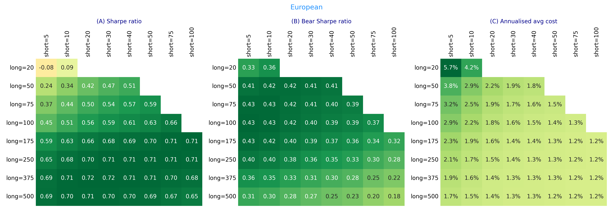
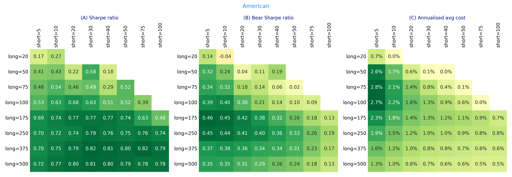
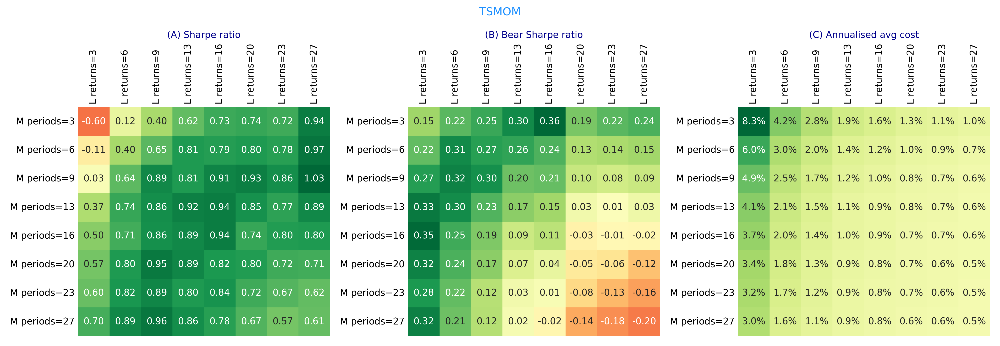
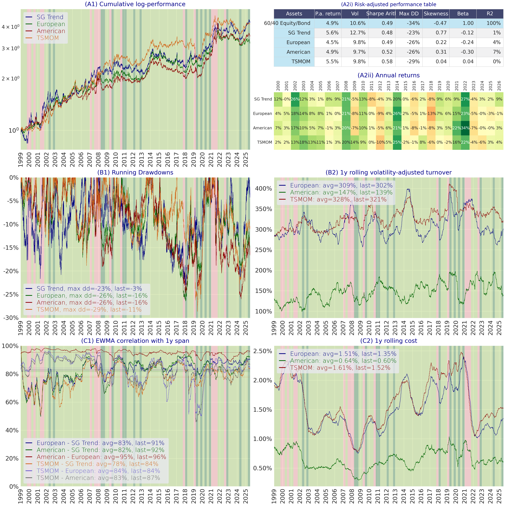
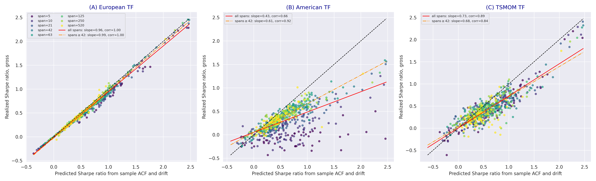
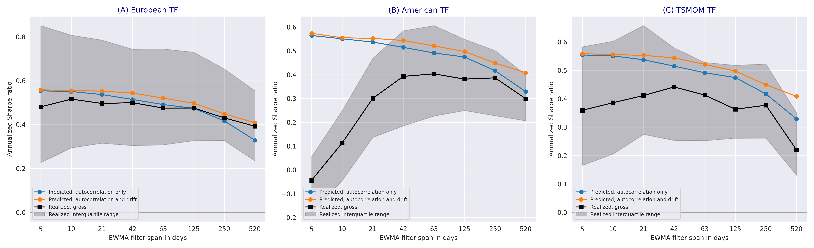

---
myst:
  html_meta:
    description: >-
      Case study of the futures evidence of Sepp and Lucic (2026): grid backtests of the European,
      American and TSMOM systems on 84 contracts, the comparison with the SG Trend Index, the
      attribution of realised Sharpe ratios to sample autocorrelation and drift, and the skewness
      of aggregated returns, with the study design, the configuration in package terms and what
      the study does and does not show.
---

# The futures evidence of Sepp and Lucic (2026)

*Author: [Artur Sepp](https://github.com/ArturSepp)*

Implemented in [trendfollowing](https://github.com/ArturSepp/TrendFollowingSystems).
Software citation: [CITATION.cff](https://github.com/ArturSepp/TrendFollowingSystems/blob/main/CITATION.cff).

This case study reports the empirical section of *The Science and Practice of Trend-Following
Systems* (Sepp and Lucic, 2026, Section 7) in the terms of this package: the study design, the
configuration of the three systems, the results as the paper states them, and what the evidence
does and does not establish. The paper's numbers are quoted with their design and are not
recomputed here; the Python block builds the study's configuration and demonstrates its central
mechanism on synthetic data.

## Overview

The study asks four questions of 84 liquid futures contracts:

1. How sensitive are the three system designs to their parameters, and which parameters give
   reasonable performance at moderate cost? (Grid backtests.)
2. Do the three designs, at matched parameters, replicate an industry benchmark? (SG Trend
   comparison.)
3. Does the European closed form, fed with each contract's sample autocorrelation and drift,
   reproduce the realised Sharpe ratios of the three systems? (Attribution.)
4. Is the positive skewness of aggregated trend-following returns visible in the data? (Skewness.)

## Study design and data

- **Universe and data.** The 84 contracts of the [packaged dataset](futures_universe_and_costs.md)
  in seven asset classes, daily from July 1959 to 10 July 2026, as continuous USD excess returns.
- **Costs.** One-way volume costs by asset class and period following Exhibit B1 of Hurst, Ooi and
  Pedersen (2017); the proportional model excludes market impact.
- **Grid backtests.** 1 January 1997 to 10 July 2026; each system on all available contracts with
  P&L aggregated at the portfolio level and no portfolio risk limits; 33-day EWMA volatility for
  the European and TSMOM systems and a 33-day range for the American; an 8 by 8 grid of parameters
  per system. Reported: the arithmetic Sharpe ratio of excess returns gross of fees, the bear
  Sharpe ratio in the 16% worst quarters of the 60/40 benchmark, and realised costs. The paper
  reads the grid as a sensitivity analysis, not a selection, because the maximum over a grid
  overstates out-of-sample value (Sullivan, Timmermann and White, 1999).
- **SG Trend comparison.** 31 December 1999 to 10 July 2026; European and American LS(250,20),
  TSMOM with $L=M=10$; static risk parameters set so that the three systems have equal volatility;
  2/20 management and performance fees applied; Ledoit–Wolf test on monthly net returns to 30 June
  2026.
- **Attribution.** For each contract, $z_t$ with a 33-day EWMA volatility, the first 250 days
  skipped, at least six years of history; the sample autocorrelation of $z_t$ to 780 lags and its
  sample drift over the full contract sample; predictions from the closed-form Sharpe ratio at
  $\kappa=0$ for spans from 5 to 520 days, against the realised Sharpe ratios of gross backtests on
  the same samples. The comparison is in sample by design.
- **Skewness.** The gross single-filter European system with a 100-day span per contract;
  standardised sample skewness of overlapping $T$-day sums, for contracts with at least six
  non-overlapping lengths of history at each horizon.

## Configuration

| Element | Paper | Package |
|---|---|---|
| Data | 84 contracts, prices, costs, benchmarks | `trendfollowing.universe.load_data()` |
| European system | LS(250,20), volatility span 33 | `trendfollowing.systems.european.run_european_tf_system(long_span=250, short_span=20, vol_span=33, ...)` |
| American system | spans 250 and 20, $\omega=p=5$ | `trendfollowing.systems.american.run_american_system(long_span=250, short_span=20, signal_atr_multiplier=5.0, stop_loss_atr_multiplier=5.0, ...)` |
| TSMOM system | $L=10$, $M=10$ | `trendfollowing.systems.tsmom.run_tsmom_system(num_ra_returns=10, num_periods=10, ...)` |
| Grids | spans, ATR multipliers, $(L,M)$ | `trendfollowing.backtests.backtest_span_grid`, `backtest_american_atr_multiplies_grid`, `backtest_tsmom_grid` |
| Regimes and Sharpe convention | 16/84 quantiles of quarterly 60/40 returns; arithmetic | `trendfollowing.backtests.regime_classifier`, `trendfollowing.backtests.PERF_PARAMS` |
| Benchmark comparison and factsheet | three systems against the benchmarks | `trendfollowing.backtests.joint_backtest` and qis factsheets |
| Sharpe difference test | Ledoit–Wolf, monthly | `trendfollowing.analytics.sharpe_test.sharpe_difference_test` |
| Attribution | closed form at sample moments | `trendfollowing.compute_annualised_sharpe` |

The block checks the configuration objects and then demonstrates the attribution mechanism on
nine synthetic contracts with different autocorrelations and drifts: predict each contract's
Sharpe ratio from its sample autocorrelation and drift, run the system, and compare.

```python
import inspect

import numpy as np
import qis
from scipy.signal import lfilter
import trendfollowing as tf
from trendfollowing.backtests import (PERF_PARAMS, TFstrategy, backtest_span_grid,
                                      backtest_tsmom_grid, regime_classifier)
from trendfollowing.systems.backtest_utils import compute_vol_norm_returns

# the study's configuration objects
assert [strategy.name for strategy in TFstrategy] == ['EUROPEAN', 'AMERICAN', 'TSMOM']
np.testing.assert_allclose(regime_classifier.q, [0.0, 0.16, 0.84, 1.0])
assert regime_classifier.freq == 'QE'
assert PERF_PARAMS.sharpe_convention == qis.perfstats.config.SharpeConvention.ARITHMETIC
span_grid = inspect.signature(backtest_span_grid).parameters
assert tuple(span_grid['long_spans'].default) == (30, 50, 75, 100, 175, 250, 375, 500)
assert tuple(span_grid['short_spans'].default) == (5, 10, 20, 30, 40, 50, 75, 100)
tsmom_grid = inspect.signature(backtest_tsmom_grid).parameters
assert list(tsmom_grid['num_periodss'].default) == [3, 6, 9, 13, 16, 20, 23, 27]

# the attribution mechanism on nine synthetic contracts, 50 years each, span 63
rng = np.random.default_rng(20261001)
n_days, span = 260 * 50, 63
predicted, realised = [], []
for phi, drift in zip(np.linspace(-0.04, 0.12, 9), np.linspace(0.4, 0.0, 9)):
    x = lfilter([1.0], [1.0, -phi], rng.standard_normal(n_days)) * np.sqrt(1.0 - phi ** 2)
    z = compute_vol_norm_returns(returns=0.01 * (x + drift / np.sqrt(260.0)), vol_span=33)[250:]
    # sample autocovariance to 780 lags, as in the paper, by FFT
    centred = z - z.mean()
    spectrum = np.fft.rfft(centred, 2 * z.size)
    autocovariance = np.fft.irfft(spectrum * np.conj(spectrum))[:781] / z.size
    sample_drift = np.sqrt(260.0) * z.mean() / np.sqrt(autocovariance[0])
    predicted.append(tf.compute_annualised_sharpe(rho=autocovariance / autocovariance[0],
                                                  long_span=span, sr_underlying=sample_drift,
                                                  variance=autocovariance[0]))
    signal = qis.compute_ewm_long_short(a=z, init_value=0.0, long_span=span, short_span=None)
    realised.append(tf.compute_realized_sharpe((signal[:-1] * z[1:])[250:], af=260.0))
correlation = np.corrcoef(predicted, realised)[0, 1]
slope = np.polyfit(predicted, realised, 1)[0]
np.testing.assert_allclose([correlation, slope], [0.993, 0.958], atol=5e-4)
```

On nine synthetic contracts the in-sample predictions from sample moments track the realised
Sharpe ratios with a correlation of 0.99 and a slope of 0.96, the same mechanism the paper
measures on the 84 futures.

## Results

### Grid backtests

For the European system, fast filters with a small long span lead to high turnover and costs.
LS(250,20) gives reasonable long-term performance at moderate turnover, with realised costs of
1.7% a year, in line with a typical CTA. The American system shows a similar pattern, with the best
total and bear Sharpe ratios around the spans 250 and 20. TSMOM is best around $M=L=10$ (Sepp and
Lucic, 2026, Section 7.1).







Figure 7.1 of Sepp and Lucic (2026), produced by `papers/tf_systems/replication/backtest_figs.py`:
the European (top), American (middle) and TSMOM (bottom) grids, each with the Sharpe ratio (A), the
bear Sharpe ratio (B) and the realised costs (C).

### Comparison with the SG Trend Index

At matched parameters the three systems generate similar performance from 31 December 1999 to
10 July 2026. They correlate with the SG Trend Index at 80% on average, and the European and
American systems with each other at 95%. The American system generates about 50% lower turnover and
costs, because it trades discretely. Volatility-normalised turnover is 300% to 400% a year for the
European and TSMOM systems and 125% to 200% for the American; notional turnover is close to 2000%,
dominated by bond and rate contracts. On monthly returns net of costs and fees, the European,
American and TSMOM systems have Sharpe ratios of 0.47, 0.50 and 0.55 against 0.47 for the index,
with Ledoit–Wolf p-values of 0.96, 0.82 and 0.62 (Sepp and Lucic, 2026, Section 7.2).



Figure 7.2 of Sepp and Lucic (2026), produced by `papers/tf_systems/replication/backtest_figs.py`.

### Attribution to autocorrelation and drift

The European closed form at each contract's sample autocorrelation and drift reproduces the
realised Sharpe ratios of the European system with a pooled correlation of 0.99 and a slope of 0.96
across contracts and spans. Applied unchanged to the other designs at matched lookbacks, it tracks
TSMOM with a correlation of 0.89 and a slope of 0.73, close to the Gaussian sign benchmark of 0.80,
and the American system with 0.92 and 0.61 at spans above one month. By span, the median
autocorrelation channel falls from 0.55 at 5 days to 0.33 at two years, and the drift channel adds
up to 0.08, growing with the span. Realised European medians run from 0.48 to 0.39, 4% to 14% below
the total prediction, with the largest gaps at short spans (Sepp and Lucic, 2026, Section 7.3).





Figures 7.3 and 7.4 of Sepp and Lucic (2026), produced by
`papers/tf_systems/replication/cross_system_attribution_figs.py` from the frozen grid cache in
`papers/tf_systems/replication/data/reference/`.

### Skewness

The cross-sectional median skewness of the 100-day European system reaches 2.33 at 55 days against
the white-noise closed form of 2.35, and its interquartile range is positive at every horizon; see
the [skewness chapter](aggregated_skewness.md) and its Figure 7.5.

## What the study does and does not show

It shows that:

- three different system designs, at matched lookbacks, deliver statistically indistinguishable
  Sharpe ratios from the SG Trend Index and correlate strongly with it and with each other;
- on liquid futures, trend-following performance is primarily an autocorrelation phenomenon, with a
  drift share that grows with the span, in the realised in-sample decomposition;
- the European closed form ranks the realised performance of the nonlinear designs empirically, at
  design-specific implementation discounts;
- positive skewness of aggregated returns is a property of the cross-section of contracts.

It does not show that:

- the sample autocorrelation and drift forecast future Sharpe ratios: the attribution is in sample,
  and the out-of-sample value of the estimated inputs is untested;
- the selected parameters are optimal out of sample: the grids are sensitivity analyses;
- the systems are equivalent to the index: failure to reject is not evidence of equivalence;
- the net results transfer to large programmes: the cost model excludes market impact.

The lag-1 autocorrelation of $z_t$ across the universe declined from about 0.04 in the 1990s to
about 0.01 after 2010, so the inputs vary slowly over decades; the paper recommends estimating them
on rolling windows with a debiased drift for any conditional use.

## Reproduce

From a repository checkout, in the prescribed environment, the full generator reproduces every
exhibit; the frozen caches render the process and attribution figures without recomputation:

```console
python -m papers.tf_systems.replication.reproduce_all_figures
python -m papers.tf_systems.replication.cached_figures
python -m papers.tf_systems.replication.sg_sharpe_test
```

The [paper and replication map](paper.md) lists the generator of each exhibit and the external
output locations. New output goes outside the checkout; the frozen reference inputs are not
regenerated to agree with new code.

## See also

- [The futures universe and cost schedule](futures_universe_and_costs.md)
- [Realised Sharpe ratios and their comparison](sharpe_inference.md)
- [Predict Sharpe from autocorrelation and drift](predict_sharpe_from_acf.md)
- [Compare and backtest the three systems](system_comparison_and_backtest.md)
- [Paper and replication](paper.md)
- [Bibliography](bibliography.md)

## References

1. Sepp, A., and Lucic, V. (2026). The Science and Practice of Trend-Following Systems. Working paper. [arXiv:2607.19497](https://arxiv.org/abs/2607.19497); [SSRN 3167787](https://papers.ssrn.com/sol3/papers.cfm?abstract_id=3167787). Section 7 reports the futures evidence.
2. Hurst, B., Ooi, Y. H., and Pedersen, L. H. (2017). A Century of Evidence on Trend-Following Investing. *The Journal of Portfolio Management*, 44(1), 15–29. [DOI: 10.3905/jpm.2017.44.1.015](https://doi.org/10.3905/jpm.2017.44.1.015). The volume-based cost schedule.
3. Ledoit, O., and Wolf, M. (2008). Robust Performance Hypothesis Testing with the Sharpe Ratio. *Journal of Empirical Finance*, 15(5), 850–859. [DOI: 10.1016/j.jempfin.2008.03.002](https://doi.org/10.1016/j.jempfin.2008.03.002). The Sharpe difference test.
4. Sullivan, R., Timmermann, A., and White, H. (1999). Data-Snooping, Technical Trading Rule Performance, and the Bootstrap. *The Journal of Finance*, 54(5), 1647–1691. [DOI: 10.1111/0022-1082.00163](https://doi.org/10.1111/0022-1082.00163). Selection bias in grid searches.
5. Sepp, A., and Lucic, V. trendfollowing: Closed-form trend-following analytics, reference system implementations, and reproducible futures evidence in Python. [Software citation metadata](https://github.com/ArturSepp/TrendFollowingSystems/blob/main/CITATION.cff).
6. Sepp, A. qis: Performance analytics, portfolio backtesting, risk analysis, and factsheet reporting in Python. [Software citation metadata](https://github.com/ArturSepp/QuantInvestStrats/blob/main/CITATION.cff).
