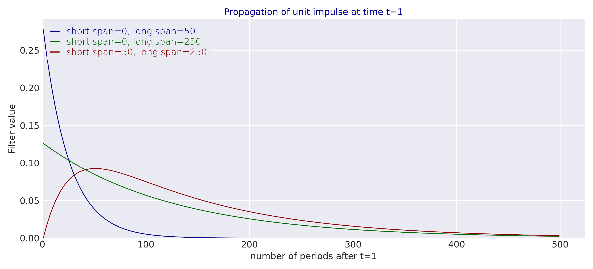

---
myst:
  html_meta:
    description: >-
      The EWMA filter of trend-following signals: span and smoothing parameter, the
      variance-preserving single filter with loading equal to the square root of the span, and
      the variance-preserving long-short filter, with impulse responses, mean gains and
      initialisation, as implemented in trendfollowing.
---

# EWMA filters and variance-preserving signals

*Author: [Artur Sepp](https://github.com/ArturSepp)*

Implemented in [trendfollowing](https://github.com/ArturSepp/TrendFollowingSystems).
Software citation: [CITATION.cff](https://github.com/ArturSepp/TrendFollowingSystems/blob/main/CITATION.cff).

An exponentially weighted moving average (EWMA) filter is a weighted sum of past observations
whose weights decay geometrically with the lag. Trend-following systems apply it to returns to
estimate the direction and strength of a trend. Scaled so that its output has the variance of
its input under serial independence, it becomes a *variance-preserving* filter, and the
difference of two such filters with different spans gives the long-short filter of the European
system. This chapter defines both, proves their unit variance, and states their impulse
responses, mean gains and start-up behaviour.

## Overview

The European trend-following system of Sepp and Lucic (2026) forms its signal by filtering
volatility-normalised returns. The filter has two jobs. It averages noisy returns into an
estimate of the local mean, which favours long spans, and it must keep the signal on a common
scale across spans, so that position sizes and the Sharpe ratio can be compared from one span to
another. The variance-preserving normalisation does the second job: a signal built from serially
independent unit-variance returns has unit variance at every span.

The chapter answers four questions:

1. How does the span map to the smoothing parameter, and how much does the filter reduce noise?
2. Which loading makes a single filter, or the difference of two filters, variance preserving?
3. Which lags does the long-short filter weight, and what is its response to a constant drift?
4. How large is the start-up error of a filter initialised at zero?

## Inputs, notation, and assumptions

| Convention | This article |
|---|---|
| Return basis | Any input sequence $y_t$; in the systems, the volatility-normalised returns $z_t$ |
| Normalisation | None inside the filter; the loadings normalise the output variance |
| Signal filter | Single filter of span $N$, or LS($N_1$,$N_2$) with $N_2\lt N_1$; $\nu=1-2/(N+1)$ |
| Moment basis | Population moments of serially independent inputs for the variance results |
| Annualisation | None: filter outputs are per observation |
| Timing | The filter at $t$ uses observations up to and including $t$ |
| Costs | Not applicable |
| trendfollowing default | `compute_ewm_long_short_weights(long_span=63, short_span=None)` |

| Symbol or input | Meaning | Units and convention |
|---|---|---|
| $y_t$ | Input sequence | Returns or normalised returns, one value per observation |
| $\mu_0$, $\vartheta_0$ | Mean and variance of a serially independent input | Per observation |
| $\mathcal{L}^{(\nu)}(y_t)$ | Raw EWMA filter | Units of $y_t$ |
| $\tilde{\mathcal{L}}^{(\nu)}(y_t)$ | Variance-preserving single filter | Units of $y_t$ |
| $\widetilde{\mathcal{LS}}^{(\nu_1,\nu_2)}(y_t)$ | Variance-preserving long-short filter | Units of $y_t$ |
| $l$, $l_1$, $l_2$ | Loadings on the raw filters | Dimensionless; $l=\sqrt{N}$ for the single filter |
| $q$, $D$ | Long-short normalisation $q=D^{-1/2}$ and its denominator $D$ | Dimensionless |
| $m^{\ast}$ | Lag of the largest long-short filter weight | Observations |

The variance results assume a serially independent input with finite variance. They are exact
under that assumption and serve as a scale convention otherwise: under serial dependence the
signal variance changes, and the [Sharpe ratio chapter](sharpe_ratio_closed_form.md) gives it.

## Methodology

### The EWMA filter

**Definition (Holt, 1957).** The EWMA filter with smoothing parameter $0\lt\nu\lt 1$ is

$$
\mathcal{L}^{(\nu)}(y_t)=(1-\nu)\sum_{m=0}^{\infty}\nu^m y_{t-m}=(1-\nu)y_t+\nu\mathcal{L}^{(\nu)}(y_{t-1}),
$$

with $\nu=1-2/(N+1)$ for a span of $N$ observations.

**Identity (unit mass).** The weights $(1-\nu)\nu^m$ sum to one, so a constant input passes
unchanged and $\mathbb{E}[\mathcal{L}^{(\nu)}(y_t)]=\mu_0$ for an input with constant mean.

**Proof.** $(1-\nu)\sum_{m\ge 0}\nu^m=(1-\nu)/(1-\nu)=1$. Take expectations term by term. $\square$

**Proposition (variance reduction).** For a serially independent input with variance
$\vartheta_0$,

$$
\operatorname{Var}\big[\mathcal{L}^{(\nu)}(y_t)\big]=\frac{1-\nu}{1+\nu}\vartheta_0=\frac{\vartheta_0}{N}.
$$

**Proof.** Independence removes the cross terms:
$(1-\nu)^2\sum_{m\ge 0}\nu^{2m}\vartheta_0=(1-\nu)^2\vartheta_0/(1-\nu^2)=(1-\nu)\vartheta_0/(1+\nu)$.
The span map gives $(1-\nu)/(1+\nu)=1/N$. $\square$

> **Insight.** For serially independent data the EWMA filter of span $N$ reduces the variance by
> the same factor $N$ as a simple moving average over $N$ observations. This is the reason the
> span, rather than the half-life, is the natural parameter of a trend filter.

### The variance-preserving single filter

**Definition.** The variance-preserving filter scales the raw filter by its inverse standard
deviation under independence:

$$
\tilde{\mathcal{L}}^{(\nu)}(y_t)=l\mathcal{L}^{(\nu)}(y_t),
\qquad
l=\sqrt{\frac{1+\nu}{1-\nu}}=\sqrt{N}.
$$

**Proposition (unit variance; Sepp and Lucic, 2026, Section 2.1).** For a serially independent
input with variance $\vartheta_0$, $\operatorname{Var}[\tilde{\mathcal{L}}^{(\nu)}(y_t)]=\vartheta_0$.

**Proof.** Multiply the variance of the raw filter by $l^2=N$. $\square$

The loading also scales the mean: for an input with constant mean $\mu_0$ the signal has mean
$\sqrt{N}\mu_0$. Its standard deviation stays at $\sqrt{\vartheta_0}$ while its mean grows with
the square root of the span, so slow filters read a drift more reliably than fast ones. The
[P&L decomposition](pnl_decomposition.md) turns this into the drift channel of the expected
return.

### The variance-preserving long-short filter

**Definition.** For distinct spans $N_1\gt N_2$ the long-short filter is the difference of two
loaded raw filters,

$$
\widetilde{\mathcal{LS}}^{(\nu_1,\nu_2)}(y_t)=l_1\mathcal{L}^{(\nu_1)}(y_t)-l_2\mathcal{L}^{(\nu_2)}(y_t),
\qquad
l_i=\frac{q}{1-\nu_i},
$$

$$
q=D^{-1/2},
\qquad
D=\frac{1}{1-\nu_1^2}+\frac{1}{1-\nu_2^2}-\frac{2}{1-\nu_1\nu_2}.
$$

Martin and Bana (2012) call this construction a double filter. Equivalently, each leg carries its
variance-preserving loading $\sqrt{N_i}$ times the factor $q/\sqrt{1-\nu_i^2}$; this is how
`compute_ewm_long_short_weights` and `qis.compute_ewm_long_short` compute it.

**Identity (impulse response).** The long-short filter weights the observation $y_{t-m}$ by

$$
\beta_m^{\mathrm{LS}}=q\left(\nu_1^m-\nu_2^m\right),
\qquad
m=0,1,2,\dots,
$$

so the weight on the current observation is zero, and the largest weight sits at the lag
$m^{\ast}=\log(\log\nu_2/\log\nu_1)/\log(\nu_1/\nu_2)$.

**Proof.** $l_i(1-\nu_i)=q$ for both legs, so the weight on $y_{t-m}$ is
$q\nu_1^m-q\nu_2^m$. At $m=0$ the two terms cancel. Setting the derivative
$\nu_1^m\log\nu_1-\nu_2^m\log\nu_2$ to zero gives $(\nu_1/\nu_2)^m=\log\nu_2/\log\nu_1$. $\square$

**Proposition (unit variance; Sepp and Lucic, 2026, Section 2.1).** For a serially independent
input with variance $\vartheta_0$ and distinct spans,
$\operatorname{Var}[\widetilde{\mathcal{LS}}^{(\nu_1,\nu_2)}(y_t)]=\vartheta_0$.

**Proof.** By the impulse response, the variance is
$q^2\vartheta_0\sum_{m\ge 0}(\nu_1^m-\nu_2^m)^2=q^2\vartheta_0\left(\frac{1}{1-\nu_1^2}+\frac{1}{1-\nu_2^2}-\frac{2}{1-\nu_1\nu_2}\right)=q^2D\vartheta_0=\vartheta_0$. $\square$

**Identity (mean gain).** For an input with constant mean $\mu_0$ the long-short signal has mean
$(l_1-l_2)\mu_0$, and

$$
l_1-l_2=\frac{q(N_1-N_2)}{2}.
$$

**Proof.** The raw filters pass the mean unchanged, and $1/(1-\nu_i)=(N_i+1)/2$. $\square$

> **Insight.** The two legs carry the identical loading $q$ on the current observation, which
> cancels. The long-short signal therefore never reacts to the latest return, and its day-to-day
> change is a difference of two lagged filters. This is why LS(250,20) trades far less than a
> single filter of span 250, as the [turnover chapter](turnover_and_net_sharpe.md) quantifies,
> while keeping a positive gain on a constant drift.

The long-short level is not a band-pass filter: its gain at frequency zero is $l_1-l_2\gt 0$.
It is the one-day increment of the signal that has zero gain at frequency zero (Sepp and Lucic,
2026, Section 5.1).



Figure 2.1 of Sepp and Lucic (2026) applies the filters to the unit impulse $(1,0,0,\dots)$. The
single filters put their largest weight on the latest observation and decay geometrically; the
long-short filter starts at zero, rises to its peak lag and decays more slowly. The figure is
produced by `papers/tf_systems/replication/filter_figs.py` through the `PaperFigure` map of
`reproduce_all_figures.py`.

### Initialisation

A filter that starts from zero before the first observation has, after $t$ observations,

$$
\mathcal{L}^{(\nu)}(y_t)=(1-\nu)\sum_{m=0}^{t-1}\nu^m y_{t-m}.
$$

Its response to a constant mean misses the fraction $\nu^t$, and under a zero-mean independent
input its standard deviation is scaled by $\sqrt{1-\nu^{2t}}$. Both effects decay geometrically
in $t$ at the rate of the span. At $N=520$ and $t=250$, the missing mean response is 38% and the
standard-deviation attenuation is 8%; at $t=750$ they are 5.6% and below 0.2% (Sepp and Lucic,
2026, Section 7.3).

## Worked example

The first part checks the loadings and the impulse response of LS(250,20) exactly, the second
compares them with the qis recursion that the European system runs, and the third confirms unit
variance by simulation.

```python
import numpy as np
import qis
import trendfollowing as tf

# span 63: smoothing parameter and the variance-preserving loading sqrt(N)
nu = tf.span_to_nu(63)
l_single, l_none = tf.compute_ewm_long_short_weights(long_span=63, short_span=None)
np.testing.assert_allclose([nu, l_single, l_none], [0.96875, np.sqrt(63.0), 0.0])

# the raw filter has unit mass and reduces the variance of independent data by 1/N
lags = np.arange(20000)
raw = (1.0 - nu) * nu ** lags
np.testing.assert_allclose([raw.sum(), np.sum(raw ** 2)], [1.0, 1.0 / 63.0])

# LS(250,20): loadings, normalisation and mean gain
l1, l2 = tf.compute_ewm_long_short_weights(long_span=250, short_span=20)
nu1, nu2 = tf.span_to_nu(250), tf.span_to_nu(20)
q = l1 * (1.0 - nu1)
np.testing.assert_allclose(l2 * (1.0 - nu2), q)
np.testing.assert_allclose([l1, l2, q], [17.9302, 1.5001, 0.142870], atol=5e-5)
denominator = 1.0 / (1.0 - nu1 ** 2) + 1.0 / (1.0 - nu2 ** 2) - 2.0 / (1.0 - nu1 * nu2)
np.testing.assert_allclose(q, denominator ** -0.5)
np.testing.assert_allclose(l1 - l2, q * (250 - 20) / 2.0)

# impulse response q * (nu1^m - nu2^m): zero at lag 0, unit sum of squares, peak at lag 27
weights = q * (nu1 ** lags - nu2 ** lags)
assert weights[0] == 0.0 and np.argmax(weights) == 27
np.testing.assert_allclose(np.sum(weights ** 2), 1.0)
peak_lag = np.log(np.log(nu2) / np.log(nu1)) / np.log(nu1 / nu2)
np.testing.assert_allclose(peak_lag, 27.44, atol=5e-3)

# the qis recursion behind the European signal has the same impulse response; its first row
# is the state before the data, so the impulse is placed in the second row
impulse = np.zeros(3001)
impulse[1] = 1.0
response = qis.compute_ewm_long_short(a=impulse, init_value=0.0, long_span=250, short_span=20)
np.testing.assert_allclose(response[1:], weights[:3000], atol=1e-14)

# Monte Carlo: the single and long-short signals of white noise have unit variance
rng = np.random.default_rng(20261001)
noise = rng.standard_normal(200_000)
single = qis.compute_ewm_long_short(a=noise, init_value=0.0, long_span=21, short_span=None)
long_short = qis.compute_ewm_long_short(a=noise, init_value=0.0, long_span=21, short_span=5)
np.testing.assert_allclose([single[1000:].var(), long_short[1000:].var()], [1.0, 1.0], atol=0.05)

# initialisation at span 520: missing mean response and standard-deviation attenuation
nu520 = tf.span_to_nu(520)
missing = [nu520 ** 250, nu520 ** 750]
attenuation = [1.0 - np.sqrt(1.0 - nu520 ** 500), 1.0 - np.sqrt(1.0 - nu520 ** 1500)]
np.testing.assert_allclose(missing, [0.3823, 0.0559], atol=5e-5)
np.testing.assert_allclose(attenuation[0], 0.0760, atol=5e-4)
assert attenuation[1] < 0.002
```

LS(250,20) has loadings $l_1=17.93$ and $l_2=1.50$ with $q=0.1429$, so its mean gain
$l_1-l_2=16.43$ equals $q(250-20)/2$. The largest filter weight falls on the return 27 days
back. At the span of 520 days the start-up attenuation of the standard deviation is 7.6% after
250 days; the paper rounds it to 8%.

## Implementation in trendfollowing

| Quantity | Formula | trendfollowing entry point |
|---|---|---|
| Smoothing parameter | $\nu=1-2/(N+1)$, span positive | `trendfollowing.span_to_nu(span)` |
| Single-filter loading | $(l,0)$ with $l=\sqrt{N}$ | `trendfollowing.compute_ewm_long_short_weights(long_span, short_span=None)` |
| Long-short loadings | $(l_1,l_2)=(q/(1-\nu_1),q/(1-\nu_2))$ | `trendfollowing.compute_ewm_long_short_weights(long_span, short_span)` |
| Filter recursion | $\mathcal{L}^{(\nu)}(y_t)=(1-\nu)y_t+\nu\mathcal{L}^{(\nu)}(y_{t-1})$ | `qis.ewm_recursion` |
| Variance-preserving signal | single or long-short, as above | `qis.compute_ewm_long_short(a, init_value, long_span, short_span)` |

The loadings live in
[filters.py](https://github.com/ArturSepp/TrendFollowingSystems/blob/main/src/trendfollowing/analytics/filters.py);
the recursion is delegated to [qis](https://github.com/ArturSepp/QuantInvestStrats), which the
[European system](european_system.md) calls through `compute_tf_signal`.
API reference: {py:func}`trendfollowing.span_to_nu` and
{py:func}`trendfollowing.compute_ewm_long_short_weights`.

Contract details:

- `span_to_nu` raises `ValueError` for a non-positive span.
- `compute_ewm_long_short_weights` returns the loadings $(l_1,l_2)$ on the *raw* filters,
  with $l_2=0$ for the single filter. It does not check that the spans differ: equal spans
  make $D=0$ and the loadings infinite. `qis.compute_ewm_long_short_filter` validates
  $N_2\lt N_1$ before filtering.
- `qis.ewm_recursion` treats the first row of its input as the state before the data. For a
  return series that starts with a missing value, as `qis.to_returns(..., is_first_zero=False)`
  produces, the first return enters the filter normally.

> **Pitfall.** The loadings returned by `compute_ewm_long_short_weights` multiply the raw filter
> $\mathcal{L}^{(\nu)}$, not the variance-preserving filter. Applying them to a filter that has
> already been scaled by $\sqrt{N}$ counts the normalisation twice.

## Interpretation and limitations

- Unit variance is exact for serially independent inputs only. A positively autocorrelated input
  raises the signal variance: under an AR(1) input with $\phi=0.1$, the single filter of span 21
  has variance $1+2\Psi_\nu=1.2$ (see the [Sharpe ratio chapter](sharpe_ratio_closed_form.md)).
- The normalisation fixes the scale of the signal, not its distribution. Signals of heavy-tailed
  or volatility-clustered inputs have occasional large values, which the European runner caps
  with `signal_cap`.
- The start-up error decays at the rate of the span; slow filters need long warmups. A 250-day
  warmup leaves a material start-up error at spans above one year.
- The filter is linear. The American and TSMOM systems apply nonlinear transformations (a
  crossover with a buffer, the sign function) whose behaviour this chapter does not describe.

## See also

- [Notation and conventions](notation_and_conventions.md)
- [Volatility normalisation and position sizing](volatility_normalisation.md)
- [The P&L decomposition: autocorrelation and drift channels](pnl_decomposition.md)
- [The closed-form Sharpe ratio](sharpe_ratio_closed_form.md)
- [The European system](european_system.md)
- [Bibliography](bibliography.md)

## References

1. Holt, C. C. (1957). Forecasting Seasonals and Trends by Exponentially Weighted Moving Averages. O.N.R. Memorandum 52/1957, Carnegie Institute of Technology. Reprinted in *International Journal of Forecasting*, 20(1), 5–10 (2004). [DOI: 10.1016/j.ijforecast.2003.09.015](https://doi.org/10.1016/j.ijforecast.2003.09.015). The EWMA filter.
2. Sepp, A., and Lucic, V. (2026). The Science and Practice of Trend-Following Systems. Working paper. [arXiv:2607.19497](https://arxiv.org/abs/2607.19497); [SSRN 3167787](https://papers.ssrn.com/sol3/papers.cfm?abstract_id=3167787). Section 2.1 defines the variance-preserving single and long-short filters.
3. Martin, R. J., and Bana, A. (2012). Nonlinear Momentum Strategies. *Risk*, 25(11), 60–65. The double filter.
4. Sepp, A., and Lucic, V. trendfollowing: Closed-form trend-following analytics, reference system implementations, and reproducible futures evidence in Python. [Software citation metadata](https://github.com/ArturSepp/TrendFollowingSystems/blob/main/CITATION.cff).
5. Sepp, A. qis: Performance analytics, portfolio backtesting, risk analysis, and factsheet reporting in Python. [Software citation metadata](https://github.com/ArturSepp/QuantInvestStrats/blob/main/CITATION.cff).
