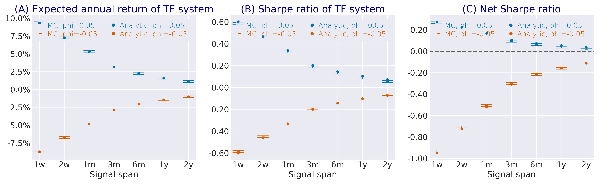

---
myst:
  html_meta:
    description: >-
      Turnover, trading costs and the net Sharpe ratio of the European trend-following system:
      volatility-normalised turnover, the closed-form signal-turnover proxy for single and
      long-short filters, the leading-order net Sharpe ratio, the AR(1) break-even cost, and
      cost-optimal spans under drift, short memory and long memory, as implemented in
      trendfollowing.
---

# Turnover, trading costs and the net Sharpe ratio

*Author: [Artur Sepp](https://github.com/ArturSepp)*

Implemented in [trendfollowing](https://github.com/ArturSepp/TrendFollowingSystems).
Software citation: [CITATION.cff](https://github.com/ArturSepp/TrendFollowingSystems/blob/main/CITATION.cff).

A trend-following system pays a cost every time its position changes, and fast filters change
their positions more. Measured in units of volatility, the turnover of the European system has a
closed form under serial independence: it falls with the square root of the span, and the
long-short filter cuts it by a factor of four relative to a single filter of the same long span.
Charging a proportional cost against this turnover gives a leading-order net Sharpe ratio, from
which follow the break-even cost of a short-memory alpha and the cost-optimal span of a
long-memory alpha. This chapter derives these results and connects them to the volume-based costs
of the backtests.

## Overview

Futures volatilities differ by an order of magnitude across asset classes, so notional turnover
is dominated by low-volatility contracts with inflated notional positions. The
volatility-normalised turnover measures each trade in units of the contract's risk and is stable
across contracts. The chapter answers four questions:

1. What is the expected turnover of a single or long-short filter?
2. How much does a proportional cost lower the Sharpe ratio, at each span?
3. Below which cost is a short-memory alpha profitable at all?
4. Which span maximises the net Sharpe ratio when the alpha has long memory?

The net results are leading-order approximations under a signal-turnover proxy; the gross results
of the previous chapters are exact.

## Inputs, notation, and assumptions

| Convention | This article |
|---|---|
| Return basis | Volatility-normalised daily returns $z_t$ with unit variance |
| Normalisation | $U_t=\sqrt{\mathrm{af}}\sigma_t\lvert w_t-w_{t-1}\rvert$, turnover in units of annualised volatility |
| Signal filter | Single filter of span $N$ or LS($N_1$,$N_2$), variance preserving |
| Moment basis | Serially independent Gaussian $z_t$ for the turnover proxy; population moments for the Sharpe ratio |
| Annualisation | Annual turnover $\mathrm{af}\mathbb{E}[U_t]$; $\mathrm{af}=260$ |
| Timing | The cost of a change in $w_t$ is charged on day $t$ |
| Costs | $c$ per unit of volatility-normalised turnover; the backtests' volume cost $k$ per unit of notional turnover |
| trendfollowing default | `expected_turnover(long_span, short_span=None, annualization_factor=260.0, vol_target=0.15)` |

| Symbol or input | Meaning | Units and convention |
|---|---|---|
| $U_t^{\mathrm{signal}}$ | Signal component $\sigma_{\mathrm{target}}\lvert S_t-S_{t-1}\rvert$ of $U_t$ | Per day |
| $\zeta$ | Half the variance of the long-short signal increment | Dimensionless |
| $k$ | Volume cost per unit of notional turnover | Decimal, one way |
| $c^{\ast}(N)$, $c_{\infty}^{\ast}$ | Break-even cost at span $N$ and its long-span limit | Per unit of $U_t$ |
| $v$ | Cost relative to the break-even limit, $c/c_{\infty}^{\ast}$ | Dimensionless |
| $C_\psi$ | Long-memory constant $\Gamma(1-d)\Gamma(2d)/\Gamma(d)$ | Dimensionless |

## Methodology

### Volatility-normalised turnover

**Definition.** The volatility-normalised turnover of day $t$ is
$U_t=\sqrt{\mathrm{af}}\sigma_t\lvert w_t-w_{t-1}\rvert$. With $w_t=S_t\sigma_{\mathrm{target}}/(\sqrt{\mathrm{af}}\sigma_t)$,

$$
U_t\le\sigma_{\mathrm{target}}\lvert S_t-S_{t-1}\rvert+\sigma_{\mathrm{target}}\left\lvert S_{t-1}\left(1-\frac{\sigma_t}{\sigma_{t-1}}\right)\right\rvert,
$$

the sum of a **signal-increment** and a **volatility-update** component. The closed forms keep the
first and omit the second, so they are proxies for the full turnover (Sepp and Lucic, 2026,
Section 4.4).

**Proposition (single filter).** For serially independent Gaussian $z_t$ with unit variance,

$$
\mathbb{E}\left[\mathrm{af}U_t^{\mathrm{signal}}\right]=\frac{2\mathrm{af}}{\sqrt{\pi}}\sigma_{\mathrm{target}}\sqrt{1-\nu} .
$$

**Proof.** The recursion gives $S_t-S_{t-1}=(1-\nu)\left(\sqrt{N}z_t-S_{t-1}\right)$, with
$S_{t-1}$ independent of $z_t$ and of unit variance, so its variance is
$(1-\nu)^2(N+1)=2(1-\nu)$. A zero-mean Gaussian $X$ has $\mathbb{E}\lvert X\rvert=\sqrt{2\operatorname{Var}[X]/\pi}$. $\square$

**Proposition (long-short filter).** Under the same assumptions,

$$
\mathbb{E}\left[\mathrm{af}U_t^{\mathrm{signal}}\right]=\frac{2\mathrm{af}}{\sqrt{\pi}}\sigma_{\mathrm{target}}\sqrt{\zeta},
\qquad
\zeta=\frac{q^2}{2}\left(\frac{1-\nu_1}{1+\nu_1}+\frac{1-\nu_2}{1+\nu_2}-\frac{2(1-\nu_1)(1-\nu_2)}{1-\nu_1\nu_2}\right).
$$

**Proof.** Since $l_1(1-\nu_1)=l_2(1-\nu_2)=q$, the terms in $z_t$ cancel and
$S_t-S_{t-1}=q\left(\mathcal{L}^{(\nu_2)}(z_{t-1})-\mathcal{L}^{(\nu_1)}(z_{t-1})\right)$, whose
variance is $2\zeta$ by the filter variances and cross-covariance. Apply the Gaussian
absolute-moment formula. $\square$

At $\sigma_{\mathrm{target}}=15\%$, the proxy is 393% a year for a single 250-day filter and 88%
for LS(250,20): the two legs share the loading $q$ on the current return, which cancels exactly in
the increment.

The proxy is exact for the signal component under its assumptions. Within the paper's simulations
it stays within 8.4% of the signal-level turnover across white noise, AR(1) and ARFIMA. Within the
full pipeline at a 33-day volatility span, the single-filter turnover exceeds the proxy by about
4%; for the long-short filter, whose signal increment is small, the volatility-update component
dominates and the proxy understates the pipeline turnover by a factor of 1.6 to 2.3 (Sepp and
Lucic, 2026, Sections 4.4 and 6.4).

### The net Sharpe ratio

**Definition (Sepp and Lucic, 2026, Section 5).** Under a proportional cost $c$ per unit of
volatility-normalised turnover,

$$
\mathrm{SR}^{\mathrm{net}}=\sqrt{\mathrm{af}}\frac{\mathbb{E}[f_t]-c\mathbb{E}[U_t]}{\sqrt{\operatorname{Var}[f_t]}}=\mathrm{SR}-c\frac{\mathbb{E}[\mathrm{af}U_t]}{\sqrt{\mathrm{af}}\sqrt{\operatorname{Var}[f_t]}} .
$$

The denominator keeps the gross volatility, so this is a cost-adjusted gross-risk ratio, not the
Sharpe ratio of $f_t-cU_t$, whose variance adds terms of first and second order in $c$. It is
independent of $\sigma_{\mathrm{target}}$, because turnover and returns both scale with it.

**Corollary (leading-order net Sharpe ratio).** With the signal-turnover proxy and the identity
$l\sqrt{1-\nu}=\sqrt{1+\nu}$,

$$
\mathrm{SR}^{\mathrm{net}}\approx\mathrm{SR}-\frac{2\mathrm{af}c}{\sqrt{\pi}}\frac{1-\nu}{\sqrt{(1+\nu)\left(B_\nu+A_\nu^2+\kappa K_\nu+(\mu_{\mathrm{an}}^2/\mathrm{af})(1+B_\nu+2A_\nu)\right)}} .
$$

**Proof.** Divide the annual proxy turnover by the annualised volatility of the
[daily-moments proposition](sharpe_ratio_closed_form.md); the factor $\sigma_{\mathrm{target}}$
cancels and $\sqrt{1-\nu}/l=(1-\nu)/\sqrt{1+\nu}$. $\square$

Under zero-drift white noise the bracket is $B_\nu=(1-\nu)/(1+\nu)$ and the cost drag is
$(2\mathrm{af}c/\sqrt{\pi})\sqrt{1-\nu}$.

### White noise with drift: any cost is beaten at a long span

$$
\mathrm{SR}^{\mathrm{net}}\approx\mu_{\mathrm{an}}^2\sqrt{\frac{N}{\mathrm{af}}}-2\mathrm{af}c\sqrt{\frac{2}{\pi N}} .
$$

The drift alpha grows with $\sqrt{N}$ while the cost drag falls with $1/\sqrt{N}$. As the span grows
the direction of the signal converges to the sign of the drift, the system converges to a
buy-and-hold exposure, and under the proxy the net Sharpe ratio converges to the absolute Sharpe
ratio $\lvert\mu_{\mathrm{an}}\rvert$ of the instrument for any proportional cost (Sepp and Lucic,
2026, Appendix C). The limit describes the proxy cost model: with an estimated volatility, the
omitted volatility-update turnover need not vanish at long spans.

### AR(1): the cost decides viability

To leading order in $\phi$,

$$
\mathrm{SR}^{\mathrm{net}}\approx 2\sqrt{\frac{\mathrm{af}}{N}}\left(\phi-c\sqrt{\frac{2\mathrm{af}}{\pi}}\right).
$$

Both terms decay with $1/\sqrt{N}$, so the sign of the net Sharpe ratio is nearly span invariant: a
knife edge.

**Proposition (break-even cost; Sepp and Lucic, 2026, Appendix C).** Under a zero-drift AR(1) with
$0\lt\phi\lt 1$, the net Sharpe ratio at the span with $\eta=1-\nu=2/(N+1)$ vanishes if and only if

$$
c=c^{\ast}(N)=\sqrt{\frac{\pi}{2\mathrm{af}}}\frac{\phi\sqrt{1-\eta/2}}{1-\phi+\eta\phi},
$$

which increases strictly in the span to the limit

$$
c_{\infty}^{\ast}=\sqrt{\frac{\pi}{2\mathrm{af}}}\frac{\phi}{1-\phi},
$$

and the net Sharpe ratio is positive at some span if and only if $c\lt c_{\infty}^{\ast}$. As $c$
approaches the limit, with $v=c/c_{\infty}^{\ast}$, the optimal span diverges as

$$
N^{\ast}\approx\frac{6\phi/(1-\phi)+3v/2}{1-v} .
$$

**Proof.** In the notation of the paper's Appendix C,
$\mathrm{SR}^{\mathrm{net}}=\sqrt{\eta}M(\eta)/\sqrt{W(\eta)}$ with $W\gt 0$ and
$M(\eta)=\sqrt{\mathrm{af}}\phi/(1-\phi+\eta\phi)-c_0/\sqrt{2-\eta}$, $c_0=2\mathrm{af}c/\sqrt{\pi}$.
$M=0$ rearranges to $c=c^{\ast}$, whose logarithmic derivative in $\eta$ is negative. The optimal
span follows from the first-order condition expanded at $\eta\to 0$. $\square$

At $\phi=0.05$ the break-even cost lies between 37bp and 41bp from one week to two years. Realistic
futures costs of 40bp to 60bp per unit of volatility-normalised turnover lie at or above that range:
to first order, costs decide the viability of a short-memory alpha.



Figure 6.2 of Sepp and Lucic (2026) shows the AR(1) case at 20bp, below the break-even cost: the
net Sharpe ratio (C) keeps the sign of the gross ratio (B), and both decline with the square root
of the span. The figure is produced by `papers/tf_systems/replication/mc_net_sharpe_paper_figs.py`
from the frozen caches in `papers/tf_systems/replication/data/reference/`.

### Long memory: an interior cost-optimal span

Under ARFIMA(0,d,0) with $0\lt d\lt 1/2$, $\Psi_\nu\approx C_\psi\eta^{-2d}$ at long spans, so the
gross Sharpe ratio decays like $\eta^{(1-2d)/2}$ while the cost drag decays faster, like
$\eta^{(1+2d)/2}$. Their ratio grows with $N^{2d}$, and the net Sharpe ratio is hump shaped.

**Proposition (large-cost limit; Sepp and Lucic, 2026, Appendix C).** As $c\to\infty$,

$$
N^{\ast}(c)\approx 2\left(\sqrt{\frac{2\mathrm{af}}{\pi}}\frac{(1+2d)c}{C_\psi(1-2d)}\right)^{1/(2d)},
$$

and the net-to-gross ratio at the optimum converges to $4d/(1+2d)$.

For small $d$ the limit lies beyond practical cost levels: at $d=0.02$ and $c=20$bp, the
continuous-span optimum of the leading-order net Sharpe ratio is at 37 days, with a net-to-gross
ratio of 0.61 against the limiting 0.08. The cost-optimal span is therefore located numerically
from the leading-order objective, not from the asymptotic law.

### Volume costs and costs per unit of volatility

The backtests charge a one-way volume cost $k$ per unit of notional turnover
$\lvert w_t-w_{t-1}\rvert$, by asset class and period, following Hurst, Ooi and Pedersen (2017).
Since $U_t=\sqrt{\mathrm{af}}\sigma_t\lvert w_t-w_{t-1}\rvert$,

$$
c=\frac{k}{\sqrt{\mathrm{af}}\sigma_t} .
$$

A 6bp equity cost at 16% volatility is 37.5bp per unit of $U_t$; a 1bp bond cost at 6% volatility is
16.7bp; a 10bp commodity cost at 25% volatility is 40bp. The [universe chapter](futures_universe_and_costs.md)
lists the schedule.

> **Insight.** The volatility-normalised turnover of the paper's systems is 300% to 400% a year
> for the European and TSMOM systems, while their notional turnover is close to 2000%, dominated by
> low-volatility bond and rate contracts (Sepp and Lucic, 2026, Section 7.2). Quote turnover in
> volatility units when comparing systems or contracts.

## Worked example

The block evaluates the turnover proxy and checks it by simulation, computes net Sharpe ratios
from the closed forms, and reproduces the break-even costs, the near-break-even optimal span and the
long-memory optimum.

```python
import numpy as np
import qis
from scipy.optimize import minimize_scalar
import trendfollowing as tf

af = 260.0

# turnover proxy at a 15% volatility target: 393% for a single 250-day filter, 88% for LS(250,20)
np.testing.assert_allclose([tf.expected_turnover(long_span=span) for span in (5, 63, 250)],
                           [25.4073, 7.7794, 3.9282], atol=5e-5)
np.testing.assert_allclose(tf.expected_turnover(long_span=250, short_span=20), 0.8800, atol=5e-5)
nu = tf.span_to_nu(63)
np.testing.assert_allclose(tf.expected_turnover(long_span=63),
                           2.0 * af / np.sqrt(np.pi) * 0.15 * np.sqrt(1.0 - nu))

# Monte Carlo of the signal turnover on serially independent unit-variance returns
rng = np.random.default_rng(20261001)
z = rng.standard_normal(400_000)
for long_span, short_span in ((21, None), (250, 20)):
    signal = qis.compute_ewm_long_short(a=z, init_value=0.0, long_span=long_span,
                                        short_span=short_span)
    simulated = 0.15 * af * np.mean(np.abs(np.diff(signal[5000:])))
    np.testing.assert_allclose(simulated,
                               tf.expected_turnover(long_span=long_span, short_span=short_span),
                               rtol=0.01)


def net_sharpe(rho, span, cost, sr_underlying=0.0):
    """leading-order net Sharpe ratio: cost per unit of volatility-normalised turnover"""
    gross = tf.compute_annualised_sharpe(rho=rho, long_span=span, sr_underlying=sr_underlying)
    _, variance = tf.compute_daily_moments(rho=rho, long_span=span, mean=sr_underlying / np.sqrt(af))
    turnover = tf.expected_turnover(long_span=span, vol_target=1.0)
    return gross - cost * turnover / np.sqrt(variance)


# the identity l sqrt(1 - nu) = sqrt(1 + nu) behind the closed-form cost drag
np.testing.assert_allclose(np.sqrt(63.0) * np.sqrt(1.0 - nu), np.sqrt(1.0 + nu))

# AR(1), phi = 0.05: positive at every span at 20bp, negative at every span at 45bp
phi = 0.05
rho_ar = tf.population_acf(n_lags=2000, phi=phi)
spans = (5, 21, 63, 250, 500)
assert all(net_sharpe(rho_ar, span, 0.0020) > 0.0 for span in spans)
assert all(net_sharpe(rho_ar, span, 0.0045) < 0.0 for span in spans)

# break-even costs rise from 36.7bp at one week to the 40.9bp limit
eta = np.array([2.0 / (span + 1.0) for span in (5, 500)])
break_even = np.sqrt(np.pi / (2 * af)) * phi * np.sqrt(1 - eta / 2) / (1 - phi + eta * phi)
limit = np.sqrt(np.pi / (2 * af)) * phi / (1 - phi)
np.testing.assert_allclose(list(break_even) + [limit], [0.003670, 0.004086, 0.004091], atol=5e-7)
for span, cost in zip((5, 500), break_even):
    assert abs(net_sharpe(rho_ar, span, cost)) < 1e-9  # exact for the leading-order net ratio

# near the limit the optimal span diverges: numerical optimum against the asymptotic rule
v = 0.95
optimum = minimize_scalar(lambda s: -net_sharpe(rho_ar, s, v * limit), bounds=(2.0, 5000.0),
                          method='bounded', options={'xatol': 1e-3})
asymptotic = (6.0 * phi / (1.0 - phi) + 1.5 * v) / (1.0 - v)
np.testing.assert_allclose([optimum.x, asymptotic], [35.36, 34.82], atol=0.01)

# long memory, d = 0.02 at 20bp: interior optimum near 37 days, net-to-gross ratio 0.61
rho_frac = tf.population_acf(n_lags=2000, d=0.02)
grid = {span: net_sharpe(rho_frac, span, 0.0020) for span in (5, 10, 21, 42, 63, 125, 250, 520)}
assert max(grid, key=grid.get) == 42
np.testing.assert_allclose([grid[5], grid[42], grid[520]], [0.071, 0.197, 0.126], atol=5e-4)
best = minimize_scalar(lambda s: -net_sharpe(rho_frac, s, 0.0020), bounds=(2.0, 2000.0),
                       method='bounded')
gross_at_best = tf.compute_annualised_sharpe(rho=rho_frac, long_span=best.x)
np.testing.assert_allclose(best.x, 36.8, atol=0.05)
np.testing.assert_allclose(-best.fun / gross_at_best, 0.608, atol=5e-4)

# white noise with drift 0.5 at 20bp: negative at fast spans, approaching |mu_an| at long spans
white_noise = tf.population_acf(n_lags=1)
np.testing.assert_allclose([net_sharpe(white_noise, 5, 0.0020, sr_underlying=0.5),
                            net_sharpe(white_noise, 500, 0.0020, sr_underlying=0.5)],
                           [-0.303, 0.254], atol=5e-4)
np.testing.assert_allclose([-net_sharpe(white_noise, 5, 0.0020, sr_underlying=0.0),
                            -net_sharpe(white_noise, 500, 0.0020, sr_underlying=0.0)],
                           [0.339, 0.037], atol=5e-4)
assert 0.48 < net_sharpe(white_noise, 20_000, 0.0020, sr_underlying=0.5) < 0.5

# a volume cost converts to a cost per unit of volatility-normalised turnover
np.testing.assert_allclose([0.0006 / 0.16, 0.0001 / 0.06, 0.0010 / 0.25],
                           [0.00375, 0.001667, 0.0040], atol=5e-7)
```

The helper `net_sharpe` uses `expected_turnover` at a unit volatility target with the daily
variance of $S_{t-1}z_t$; the same calculation runs across spans in
[`examples/analytic_sharpe_vs_span.py`](https://github.com/ArturSepp/TrendFollowingSystems/blob/main/examples/analytic_sharpe_vs_span.py).
At $\phi=0.05$ the net Sharpe ratio is positive at every span at 20bp and negative at every span at
45bp. Under long memory with $d=0.02$ the grid optimum is 42 days with a net Sharpe ratio of 0.197,
the continuous optimum 36.8 days. Under white noise with drift 0.5, the net Sharpe ratio is 0.25 at
two years, and the pure cost drag falls from 0.34 at one week to 0.04 at two years.

## Implementation in trendfollowing

| Quantity | Formula | trendfollowing entry point |
|---|---|---|
| Expected annual signal turnover | $(2\mathrm{af}/\sqrt{\pi})\sigma_{\mathrm{target}}\sqrt{1-\nu}$ or $\sqrt{\zeta}$ | `trendfollowing.expected_turnover(long_span, short_span=None, annualization_factor=260.0, vol_target=0.15)` |
| Daily variance of $S_{t-1}z_t$ | denominator of the net ratio | `trendfollowing.compute_daily_moments(rho, long_span, short_span, mean, variance)` |
| Gross Sharpe ratio | numerator of the net ratio | `trendfollowing.compute_annualised_sharpe(rho, ...)` |
| Realised turnover and costs of a backtest | $\lvert w_t-w_{t-1}\rvert$, times $k$, and $U_t$ | `portfolio_turnover`, `portfolio_cost` and `portfolio_vol_turnover` of `BacktestOutputs` |

`expected_turnover` lives in
[expected_return.py](https://github.com/ArturSepp/TrendFollowingSystems/blob/main/src/trendfollowing/analytics/expected_return.py).
There is no net Sharpe function: compose it from the three functions above as the example does.
The backtest turnover fields are described in the [European system chapter](european_system.md).
API reference: {py:func}`trendfollowing.expected_turnover`.

> **Pitfall.** `expected_turnover` is the independence-based proxy for the signal component. It is
> not the turnover of a correlated process, and it omits the volatility-update component, which
> for a long-short filter roughly doubles the pipeline turnover. Treat the net closed forms as
> leading-order screens and confirm a cost decision with a backtest.

## Interpretation and limitations

- The proportional cost model excludes market impact, which grows nonlinearly with trade size and
  binds for large programmes.
- The break-even analysis concerns the proxy cost model. The pipeline turnover of a single filter
  exceeds the proxy by about 4% at a 33-day volatility span, which places the AR(1) break-even
  costs slightly below the 37bp to 41bp range.
- The optimal-span results are statements about one instrument with a stationary
  autocorrelation. Portfolios of instruments with different autocorrelations and costs need a
  span per instrument or a compromise.
- The asymptotic formulas are limits. Use them for the shape of the trade-off and locate an
  optimum numerically from the leading-order objective.

## See also

- [The closed-form Sharpe ratio](sharpe_ratio_closed_form.md)
- [Sharpe ratios under white noise, AR(1) and ARFIMA](sharpe_under_processes.md)
- [The European system](european_system.md)
- [The futures universe and cost schedule](futures_universe_and_costs.md)
- [Closed-form analytics and span selection](closed_form_analytics.md)
- [Bibliography](bibliography.md)

## References

1. Sepp, A., and Lucic, V. (2026). The Science and Practice of Trend-Following Systems. Working paper. [arXiv:2607.19497](https://arxiv.org/abs/2607.19497); [SSRN 3167787](https://papers.ssrn.com/sol3/papers.cfm?abstract_id=3167787). Sections 4.4, 5 and 6 and Appendix C derive the turnover proxy, the net Sharpe ratio and the cost asymptotics.
2. Hurst, B., Ooi, Y. H., and Pedersen, L. H. (2017). A Century of Evidence on Trend-Following Investing. *The Journal of Portfolio Management*, 44(1), 15–29. [DOI: 10.3905/jpm.2017.44.1.015](https://doi.org/10.3905/jpm.2017.44.1.015). The volume-based cost schedule of Exhibit B1.
3. Sepp, A., and Lucic, V. trendfollowing: Closed-form trend-following analytics, reference system implementations, and reproducible futures evidence in Python. [Software citation metadata](https://github.com/ArturSepp/TrendFollowingSystems/blob/main/CITATION.cff).
